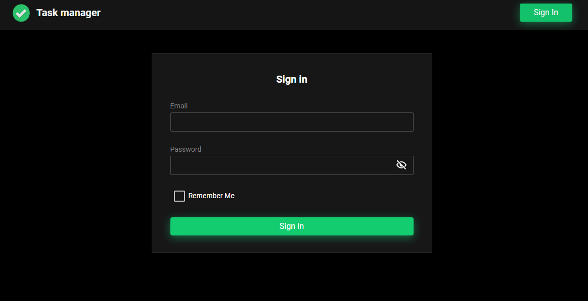
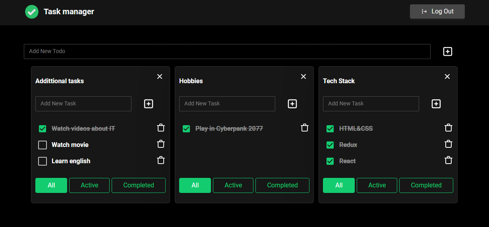

# Task-manager

https://melion11.github.io/task-manager

Todolist is a simple and easy-to-use task management app to help you organise your day. It allows you to create to-do lists, helping you to be more organised and efficient.
If you don't want to register, please enter the following details:
- email: free@samuraijs.com
- password: free

There are main sections in the app. Here you can create a to-do list

The project is under development.
If you have questions or want to know something, you can write to [me](https://www.linkedin.com/in/ilya-grinyak/).

---

### Technologies:

- React
- TypeScript
- Redux-Toolkit
- Redux-Toolkit Query  
- React-Router-Dom
- React Hook From
- SCSS Modules
- Storybook
